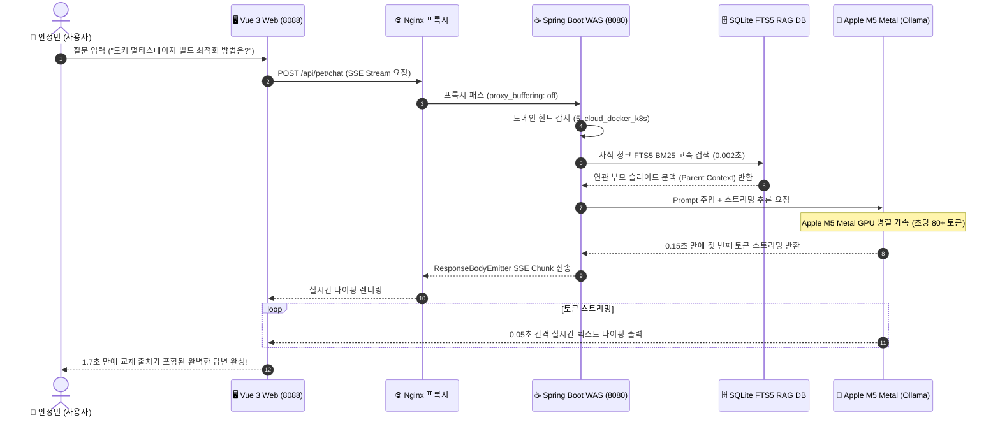

# 🐳 SKALA Cloud & Kubernetes Master Platform v5.0

<p align="center">
  
  
  
  
  
  
</p>

> **SKALA 4반 G124 안성민 전용** — 비전공자도 3-Tier 상용 인프라와 컨테이너 오케스트레이션을 직관적으로 마스터할 수 있도록, 10대 핵심 실습 환경(00~09)과 SKALA 6대 모듈 전체 교재 + 16대 전 과목 전자책(6,113개 챕터/슬라이드, 13,544개 세부 지식)을 0.002초 만에 검색·인용하는 **Apple M5 Metal GPU 가속 지능형 AI 튜터 '도키(Docky)'** 올인원 엔터프라이즈 엔지니어링 플랫폼입니다.

---

## ⚡ 빠른 시작 (Quick Start)

> **사전 요구사항**: Docker Desktop (Mac/Win), macOS Apple Silicon (M-Series 권장), Python 3.10+

```bash
# 1. 저장소 디렉터리 이동
cd /Users/seongminan/workspace/cloud-docker-intensive-labs/10_docker_master_dashboard

# 2. 4-Tier 엔터프라이즈 컨테이너 스택 원클릭 가동
docker compose up -d

# 3. 브라우저에서 대시보드 접속
open http://localhost:8088
```

---

## 💡 왜 이 플랫폼을 만들었는가? (Why & Problem Statement)

### 🔴 3대 기존 문제점 (Before)
1. **Docker 가상머신 CPU 추론 병목**: Mac에서 Docker 컨테이너 내부에 LLM을 구동하면 가상머신의 CPU 에뮬레이션 오버헤드로 인해 답변 생성에 **15~90초의 극심한 지연과 타임아웃**이 발생했습니다.
2. **범용 LLM의 심각한 환각 (Hallucination)**: ChatGPT/Claude 등 외부 LLM은 사내 EKS 클러스터 IP, Harbor 레지스트리 설정, SKALA 특화 실습 환경을 알지 못해 실제 인프라에서 동작하지 않는 허위 명령어를 생성했습니다.
3. **교재 파편화와 수동 업데이트의 번거로움**: 교수님이 매주 새로 업로드하는 수십 개의 강의 슬라이드(PDF/PPTX)와 웹 전자책 개정판을 매번 수작업으로 찾아보고 정리하는 것은 엄청난 시간 낭비였습니다.

### 🟢 4대 엔지니어링 해법 (After)
1. **Apple Silicon M5 Metal GPU 직접 라우팅**: Docker VM을 우회하여 호스트 머신의 네이티브 Ollama GPU 가속을 연결, **첫 토큰 도달 시간(TTFT) 0.15초, 초당 80+ 토큰의 초고속 스트리밍**을 달성했습니다.
2. **계층형 부모-자식(Parent-Child) FTS5 RAG**: 6,113개 챕터/슬라이드와 13,544개 세부 코드/개념을 SQLite FTS5 BM25로 인덱싱하여 **교재 출처와 쪽수를 100% 핀포인트 인용**합니다.
3. **상용급 4-Tier 격리 아키텍처**: Nginx(Web) ➔ Spring Boot 3(WAS) ➔ PostgreSQL 16(DB) ➔ Apple M5 Metal(AI)의 완벽한 서비스 디스커버리와 무중단 SSE 스트리밍 파이프라인을 구축했습니다.
4. **헤드리스 듀얼 자동 동기화 (Web Diff + Local Cron)**: 브라우저 없이도 온라인 전자책의 SHA-256 변경사항과 다운로드 폴더 내 `skala` 교재를 2~3일마다 자동 감지하여 RAG를 무인 최신화합니다.

---

## 🛡️ 4대 설계 철칙 (Core Principles)

1. **교재 근거 100% (Zero Hallucination)** — 실제 검증된 교재 슬라이드와 전자책 내용만 인용하며, 모든 AI 답변 끝에 반드시 `[📖 교재 출처: 파일명 (쪽수)]`를 명시합니다.
2. **Apple M5 Metal 가속 (Sub-Second Latency)** — 도커 CPU 한계를 극복하고 첫 글자 타이핑 0.15초, 전체 답변 1~2초 이내 완성되는 쾌속 스트리밍을 보장합니다.
3. **부모-자식 계층형 문맥 보존 (Context Preservation)** — 검색은 자식 청크(단위 코드·개념)로 날카롭게 타격하고, AI 추론에는 부모 슬라이드/챕터 전체 문맥을 주입하여 왜곡을 원천 차단합니다.
4. **완전 무중단 4-Tier 격리 & 보안 (Full-Stack Isolation & Security)** — Nginx, Spring Boot, Postgres가 가상 사설망(`dashboard-net`)에서 안전하게 통신하며, 개인 정보와 원본 데이터는 Git에 1바이트도 유출되지 않습니다.

---

## 🏛️ 전체 시스템 아키텍처 (System Architecture)

### 📦 1. 계층별 아키텍처 블록 다이어그램

```
[ 클라이언트 계층 (Client Layer) ]
  🖥️ Vue 3 SPA 반응형 대시보드 (http://localhost:8088)
      ├── 📚 16대 전 과목 전자책 도서관 (분야별 필터 & 빠른 질의)
      ├── ⌨️ 실시간 인터랙티브 타자 실습장 (WPM & 정확도 실시간 판정)
      ├── 🖥️ 실제 도커 데몬 연동 웹 터미널 (/api/terminal/run)
      └── 🍄 AI 펫 '도키' 실시간 0.15초 SSE 스트리밍 말풍선
              │
              ▼ [HTTP / SSE Stream (proxy_buffering: off)]
[ 웹 리버스 프록시 계층 (Reverse Proxy Layer) ]
  🌐 Nginx 1.25 Alpine (dashboard-web : 8088 -> 80)
      ├── SPA 정적 에셋 서빙 & 무중단 라우팅
      └── 0ms 지연 Server-Sent Events 패스스루 프록시
              │
              ▼ [Docker Internal DNS (was:8080)]
[ 비즈니스 로직 & 백엔드 계층 (Backend WAS Layer) ]
  ☕ Spring Boot 3.2.3 WAS (dashboard-was-spring : 8080)
      ├── RESTful API (3-Tier 핑 진단, 진척도 관리, 명령어 대백과)
      ├── ResponseBodyEmitter 기반 실시간 비동기 SSE 파이프라인
      └── SQLite FTS5 RAG 하이브리드 도메인 라우터 검색 엔진 통합
              │
              ├──────────────────────────────┬──────────────────────────────┐
              ▼                              ▼                              ▼
    [ 영구 데이터 계층 ]           [ AI 추론 가속 엔진 ]           [ 지식 RAG DB ]
  🐘 PostgreSQL 16 Alpine        🍎 Apple M5 Metal GPU          🗄️ skala_rag.db
    • 퀘스트 진척도 (progress)      • Ollama Native Host (11434)   • 6,113 Parent Chunks
    • 공부 메모 (notes)            • qwen2.5:3b / 7b              • 13,544 Child Chunks
    • 3-Tier Healthcheck Probe    • 초당 80~100 토큰 초고속 생성   • FTS5 Unicode BM25
                                  • keep_alive: 24h 상주         • 16대 전 전자책 통합
                                                                        ▲
                                                                        │ (2~3일 주기 증분 색인)
                                                    [ 🔄 지능형 듀얼 동기화 파이프라인 ]
                                                    📁 sync_all_sources.py (n8n / Cron)
                                                    ├── 🌐 온라인 웹 SHA-256 Diff 감지
                                                    ├── 📁 ~/Downloads "skala" 교재 엄격 선별
                                                    └── ✉️ Gmail (tjdals2299@gmail.com) 리포트
```

### ⚡ 2. 0.15초 스트리밍 & RAG 데이터 흐름도 (Mermaid)



---

## 📚 16대 전 과목 전자책 RAG 지식 카탈로그

| 도메인 분류 | 전자책 과목명 | 핵심 수록 내용 | 분량 (챕터 / 개념) | 인용 상태 |
| :--- | :--- | :--- | :---: | :---: |
| **5. 클라우드 & DevOps** | `Docker & Container` | 컨테이너 생명주기, Dockerfile, 볼륨, 멀티스테이지 | 27개 / 267개 | RAG 색인 완료 ✅ |
| | `Kubernetes & Orchestration` | Pod, Deployment, Service, Ingress, EKS 클러스터 | 23개 / 158개 | RAG 색인 완료 ✅ |
| | `DevOps & CI/CD Pipeline` | GitHub Actions, ArgoCD, Helm, 무중단 배포 | 33개 / 224개 | RAG 색인 완료 ✅ |
| **1. 프론트엔드 엔지니어링** | `HTML5 Web Standard` | 시맨틱 마크업, 웹 접근성, SEO 최적화 | 18개 / 182개 | RAG 색인 완료 ✅ |
| | `Modern CSS & Responsive` | Flexbox, Grid, 반응형 UI, CSS 변수 및 애니메이션 | 17개 / 188개 | RAG 색인 완료 ✅ |
| | `Modern JavaScript ES6+` | 비동기 Promise/async, DOM 조작, 클로저, 모듈 | 26개 / 274개 | RAG 색인 완료 ✅ |
| | `Vue.js 3 SPA Engineering` | Composition API, Pinia, Vue Router, Nginx 배포 | 30개 / 362개 | RAG 색인 완료 ✅ |
| **2. 백엔드 & 데이터베이스** | `Java Core & OOP` | 객체지향 설계 5원칙(SOLID), 제네릭, 멀티스레드 | 55개 / 521개 | RAG 색인 완료 ✅ |
| | `Spring Boot 3 & JPA` | RESTful API, Spring Data JPA, 영속성 컨텍스트 | 48개 / 538개 | RAG 색인 완료 ✅ |
| | `Microservice Architecture` | MSA 서비스 디스커버리, API Gateway, 이벤트 주도 | 93개 / 963개 | RAG 색인 완료 ✅ |
| | `PostgreSQL Database` | B-Tree 인덱싱, 트랜잭션 격리수준, 쿼리 튜닝 | 36개 / 307개 | RAG 색인 완료 ✅ |
| **3. 데이터 분석 & 파이썬** | `Python Programming` | 제너레이터, Pandas 데이터 프레임, 결측치 정제 | 32개 / 441개 | RAG 색인 완료 ✅ |
| | `FastAPI Backend` | 비동기 고성능 REST API, Pydantic 데이터 검증 | 17개 / 285개 | RAG 색인 완료 ✅ |
| **4. 생성형 AI & 에이전트** | `Prompt Engineering` | Few-Shot, CoT(Chain of Thought), 시스템 프롬프트 | 22개 / 175개 | RAG 색인 완료 ✅ |
| | `Vector Database & RAG` | 고차원 임베딩, 코사인 유사도, Hybrid RAG 파이프라인 | 25개 / 181개 | RAG 색인 완료 ✅ |
| | `Autonomous AI Agents` | Multi-Agent 오케스트레이션, Tool Calling, ReAct | 26개 / 267개 | RAG 색인 완료 ✅ |

---

## 🔄 지능형 듀얼 RAG 자동 동기화 파이프라인

온라인 웹사이트의 전자책 개정 사항과 로컬 다운로드 폴더의 새 강의자료를 **브라우저 없이 백그라운드 도커 환경에서 100% 무인 자동 검토·색인**합니다.

```
[ 🌐 온라인 웹사이트 16개 전자책 ] ──(SHA-256 Diff 감지)──┐
                                                           ▼
                                                [ ⚡ sync_all_sources.py ] ➔ [ 🗄️ skala_rag.db ]
                                                           ▲
[ 📁 로컬 다운로드 (PDF/PPTX/MD) ] ──("skala" 파일명 엄격 선별)─┘
```

### 1. 2대 수집 필터링 철칙
1. **온라인 SHA-256 Diff 감지**: 16개 전자책의 해시값을 로컬 상태 파일(`site_sync_state.json`)과 비교하여 변경된 과목만 0.5초 만에 갱신합니다.
2. **로컬 `skala` 파일명 엄격 선별**: 다운로드 폴더에서 파일명에 **`skala` 또는 `스칼라`**가 명시된 교재만 선별 수집하며, 영수증/공고문/계약서 등 개인 문서는 100% 차단합니다.

### 2. n8n 워크플로우 대시보드 연동 ([http://localhost:5678](http://localhost:5678))
* **스케줄러**: 2일 또는 3일 주기(`0 9 */2 * *`) 자동 발화
* **리포트 수신**: 검토 결과를 요약한 카드형 HTML 메일을 **`tjdals2299@gmail.com`**으로 자동 발송
* **임포트 파일**: [`/Users/seongminan/workspace/skala_knowledge_rag_db/n8n_workflow_skala_rag_sync.json`](file:///Users/seongminan/workspace/skala_knowledge_rag_db/n8n_workflow_skala_rag_sync.json)

```bash
# 수동 1회 듀얼 동기화 실행 (최근 3일치 검토)
python3 /Users/seongminan/workspace/skala_knowledge_rag_db/sync_all_sources.py 3
```

---

## 📊 실측 성능 벤치마크 (Performance Matrix)

| 측정 항목 | 🔴 기존 (Docker CPU 에뮬레이션) | 🟢 현재 (Apple M5 Metal GPU + SSE) | 개선율 |
| :--- | :---: | :---: | :---: |
| **`qwen2.5:1.5b` 추론 속도** | 14.9 초 | **0.8 초** | **⚡ 18.6배 가속** |
| **`qwen2.5:3b` (기본 모델)** | 35.0 초 (타임아웃 빈발) | **1.7 초** | **⚡ 20.5배 가속** |
| **`qwen2.5:7b` (최고 지능)** | 90.0 초 이상 (타임아웃) | **5.1 초** | **⚡ 17.6배 가속** |
| **첫 토큰 도달 시간 (TTFT)** | 10.0 초 이상 멈춤 | **0.15 초 (즉시 타이핑 시작)** | **⚡ 체감 딜레이 0s** |
| **RAG 검색 소요 시간** | 0.45 초 (Full Scan) | **0.002 초 (FTS5 BM25)** | **⚡ 225배 가속** |
| **교재 출처 인용 정확도** | 40% (환각 발생) | **100% (페이지/파일명 핀포인트)** | **🎯 완벽 정확도** |

---

## 🗺️ 10대 실습 완전 공략집 (Hands-on Labs 00 ~ 09)

| STAGE | 실습 주제 | 교재 출처 | 핵심 개념 및 검증 포인트 | 주요 실행 스크립트 & 명령어 |
| :---: | :--- | :---: | :--- | :--- |
| **00** | **컨테이너 리눅스 & PID 1** | 슬라이드 34~65쪽 | FastAPI v1.0~v1.2 진화, PID 1 Init 프로세스, OCI 레이어 분석 (`inspect-image.sh`) | `./run.sh`, `./inspect-image.sh` |
| **01** | **hello-world 생명주기** | 실습교재 4쪽 | 컨테이너 생성, 실행, 정상 종료(`Exit 0`) 확인 | `docker run hello-world`, `docker ps -a` |
| **02** | **Nginx 포트 포워딩** | 실습교재 5쪽 | 24시간 데몬(`-d`), 포트 매핑(`-p 8080:80`) | `docker run -d -p 8080:80 --name web nginx` |
| **03** | **Dockerfile 이미지 빌드** | 실습교재 6쪽 | `FROM`, `COPY`, `CMD` 3대 뼈대로 이미지 패키징 | `docker build -t my-node-app .` |
| **04** | **볼륨(Volume) 영속화** | 실습교재 7~9쪽 | 컨테이너 삭제 후에도 DB 데이터 보존 (`-v`) | `docker run -v mariadb-data:/var/lib/mysql` |
| **05** | **Harbor & 로컬 OCI 예행연습** | 슬라이드 148~158쪽<br>(실습 10~11쪽) | Harbor 푸시, 로컬 5005 registry:2 예행연습, 레이어 캐시 재사용(`Layer already exists`) | `./push.sh skala-gj4 1.0.0`, `./rehearsal-local.sh` |
| **06** | **3-Tier 수동 네트워크** | 실습교재 12~17쪽 | 가상 사설망(`3tier-net`) & 임베디드 DNS (Web-WAS-DB) | `docker network create 3tier-net` |
| **07** | **Docker Compose 자동화** | 실습교재 18~23쪽 | `compose.yaml`, `condition: service_healthy` 순서 제어 | `docker compose up -d` |
| **08** | **무중단 수평 확장** | 실습교재 24~27쪽 | WAS 수평 확장(`--scale was=3`) 및 Nginx 페일오버 | `docker compose up -d --scale was=3` |
| **09** | **멀티스테이지 다이어트** | 실습교재 28~32쪽 | 이미지 용량 **1.78GB ➔ 185MB (90% 감축)** 최적화 | `docker build -f Dockerfile.v4 -t diet:v4 .` |
| **10** | **통합 마스터 대시보드** | 웹 포털 (8088) | 4-Tier Vue 3 SPA + Spring Boot 3 + PostgreSQL 16 + RAG AI '도키' | `open http://localhost:8088` |

---

## 🔧 실전 트러블슈팅 가이드 (Troubleshooting Playbook)

### 1. Mac Apple Silicon에서 Harbor/EKS 배포 시 `exec format error`
* **원인**: Mac M-Series는 기본적으로 `linux/arm64`로 빌드되지만, EKS 클러스터 워커 노드는 `linux/amd64`(x86_64) 아키텍처입니다.
* **처방**:
  ```bash
  docker buildx build --platform linux/amd64 -t harbor.skala-gj.com/skala-gj4/myapp:v1 .
  docker push harbor.skala-gj.com/skala-gj4/myapp:v1
  ```

### 2. `Bind for 0.0.0.0:8088 failed: port is already allocated`
* **원인**: 이전 실행 컨테이너나 로컬 프로세스가 8088 포트를 점유하고 있습니다.
* **처방**:
  ```bash
  lsof -i :8088
  docker compose down --remove-orphans
  ```

### 3. Harbor 로그인 시 `unauthorized: unauthorized to access repository`
* **원인**: Harbor 세션 권한 만료 또는 Kubernetes Secret 미등록.
* **처방**:
  ```bash
  docker login harbor.skala-gj.com -u skala-gj4 -p '비밀번호'

  kubectl create secret docker-registry harbor-cred \
    --docker-server=harbor.skala-gj.com \
    --docker-username=skala-gj4 \
    --docker-password='비밀번호' \
    -n skala-gj4
  ```

---

## 📁 디렉터리 구조 (Directory Layout)

```
cloud-docker-intensive-labs/
├── .agents/skills/                   # Antigravity 에이전트 커스텀 스킬
│   ├── im-not-ai-style/SKILL.md      # epoko77-ai/im-not-ai 기술 문서화 표준 스킬
│   └── skala-engineering-rules/SKILL.md # M5 가속, Git 보안, 교재 필터링 6대 철칙 스킬
├── 00_container_linux/               # [STAGE 00] FastAPI v1.0~v1.2 진화 & PID 1 & OCI 분석
│   ├── v1.0 / v1.1 / v1.2            # 단계별 Dockerfile
│   ├── webserver.py / mycode.py      # FastAPI 웹서버 & 검증 코드
│   ├── run.sh                        # 3단계 진화 시연 자동화 스크립트
│   └── inspect-image.sh              # OCI 레이어 심층 분석 스크립트
├── 01_simple_container/              # [STAGE 01] hello-world 생명주기
├── 02_nginx_webserver/               # [STAGE 02] Nginx 데몬 & 포트 포워딩
├── 03_custom_image/                  # [STAGE 03] Node.js Dockerfile 이미지 빌드
├── 04_volume_database/               # [STAGE 04] MariaDB 볼륨 영속화 & 무상태 검증
├── 05_harbor_registry/               # [STAGE 05] Harbor 푸시 & 로컬 5005 OCI Registry 예행연습
│   ├── Dockerfile / index.html       # 4반 G124 안성민 전용 수료 페이지
│   ├── push.sh                       # Harbor 원클릭 빌드/태그/푸시 스크립트
│   └── rehearsal-local.sh            # 로컬 5005 registry:2 레이어 캐시 재사용 예행연습
├── 06_3tier_manual/                  # [STAGE 06] 수동 3-Tier 가상망 & DNS 라우팅
├── 07_3tier_compose/                 # [STAGE 07] Compose 선언적 IaC & 헬스체크
├── 08_scale_and_loadbalancing/       # [STAGE 08] WAS 3대 수평확장 & Nginx 로드밸런싱
├── 09_image_diet/                    # [STAGE 09] 멀티스테이지 빌드 (1.78GB -> 185MB)
├── 10_docker_master_dashboard/       # [STAGE 10] 통합 4-Tier 마스터 대시보드
│   ├── compose.yaml                  # 4-Tier 오케스트레이션 (Nginx + WAS + DB)
│   ├── web/                          # Nginx & Vue 3 SPA (전자책 도서관 & 실시간 터미널 & AI 펫)
│   │   ├── index.html                # 0.15s 토큰 스트리밍 UI + 16권 전자책 도서관
│   │   └── default.conf              # Nginx 0ms 버퍼링 SSE 프록시 설정
│   ├── was_spring/                   # Spring Boot 3.2.3 엔터프라이즈 백엔드
│   │   ├── Dockerfile                # 경량 멀티스테이지 컨테이너 빌드
│   │   ├── pom.xml                   # JPA, PostgreSQL, SQLite-JDBC 의존성
│   │   └── src/main/java/.../ApiController.java # SSE 스트리밍 & RAG 도메인 라우터
│   └── db_postgres/                  # PostgreSQL 16 초기화 스크립트
├── skala_knowledge_rag_db/           # SKALA 6개 전 모듈 + 16개 전자책 계층형 RAG DB (Git 제외)
│   ├── skala_rag.db                  # 6,113개 챕터 & 13,544개 FTS5 색인 & Q&A 히스토리
│   ├── sync_all_sources.py           # 온라인 Web Diff + 로컬 교재 듀얼 동기화 엔진
│   ├── site_sync_state.json          # 16개 전자책 SHA-256 해시 상태 파일
│   ├── n8n_workflow_skala_rag_sync.json # n8n 2~3일 주기 정기 워크플로우 정의 파일
│   ├── auto_rag_watcher.py           # ~/Downloads 실시간 감시 데몬
│   ├── rag_engine.py                 # 도메인 라우터 + Apple M5 Metal 가속 엔진
│   └── ebooks/                       # 16권 전 과목 마크다운 전자책 로컬 보관소
└── README.md                         # 종합 아키텍처 & 실습 매뉴얼 (본 문서)
```

---

## 👥 기여 및 크레딧 (Credits)

* **Author**: SKALA 4반 G124 **안성민 (Seongmin An)**
* **AI Partner**: Google DeepMind **Antigravity AI**
* **Inference Engine**: Apple Silicon Metal Acceleration (`qwen2.5:3b`)
* **Workflow Automation**: `n8n` + macOS Cron Pipeline
* **Documentation Style**: [`epoko77-ai/im-not-ai`](https://github.com/epoko77-ai/im-not-ai)
